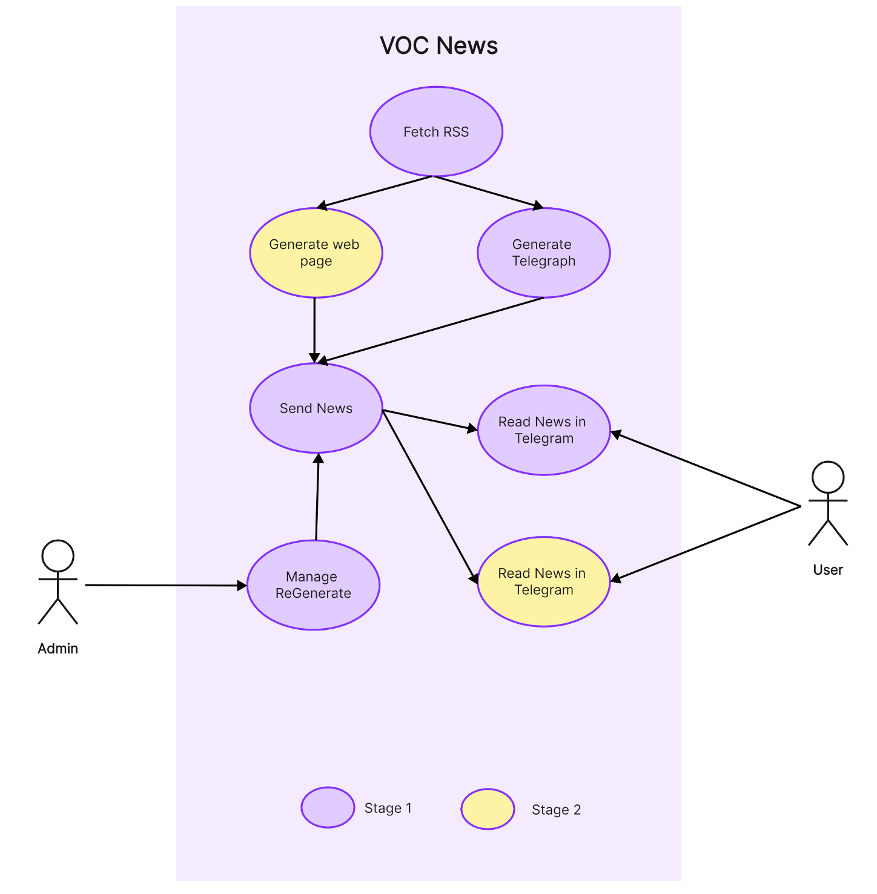
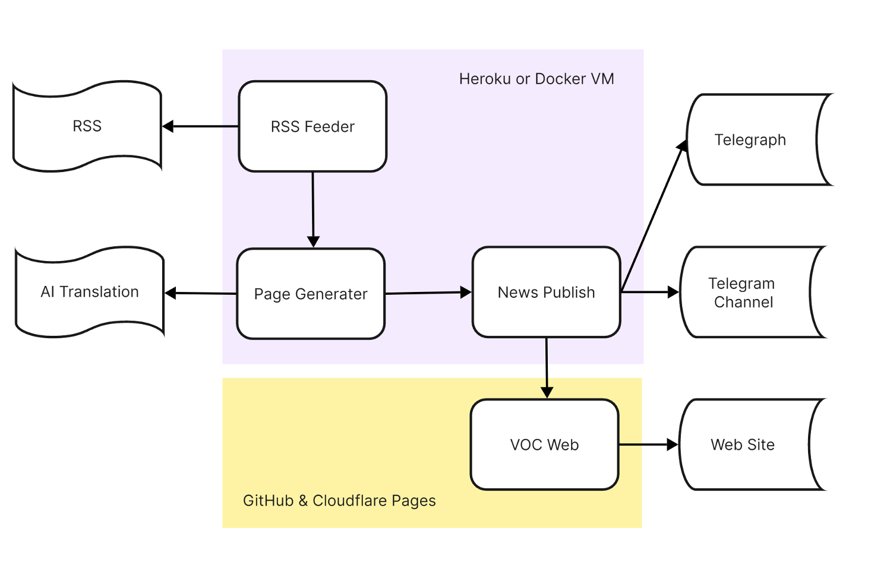

# VOCNewsBack

## Project description

This project will complete a news site like this one for Chinese people, it will have a front end that uses Gatsby and React to display news. There won't be a full backend, but there will be a service that gets news via RSS, translates it into Chinese, and updates the news site through a publishing system.

## Technologies used

- Front end: Gatsby, React, Tailwindcss
- Back end: Python, Ollama, Nodejs
- Cloud service: Cloudflare Pages, Cloudflare Images, Cloudflare Function, Doppler, MongoDB
- CI: GitHub workflow, pyunit, React Testing Library, jest

## Special features

- Share to social media can be friendly to display content
- Automatic posting to websites and Telegram channels
- Fully automated updating and operation
- Telegram Bot allows you to monitor the operation of your system

## Use Case

## System Architecture

